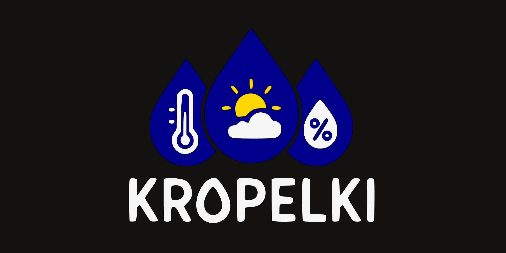

| | | |
|-|-|-|
| `firmware` | Firmware for the ESP32-based weather station | [/Kropelki/firmware](https://github.com/Kropelki/firmware) |
| `tf-infra` | Terraform-managed infrastructure for the project | [/Kropelki/tf-infra](https://github.com/Kropelki/tf-infra) |
| `fastapi-tester` | ESP32 weather station testing server built with FastAPI | [/Kropelki/fastapi-tester](https://github.com/Kropelki/fastapi-tester) |
| | | |

